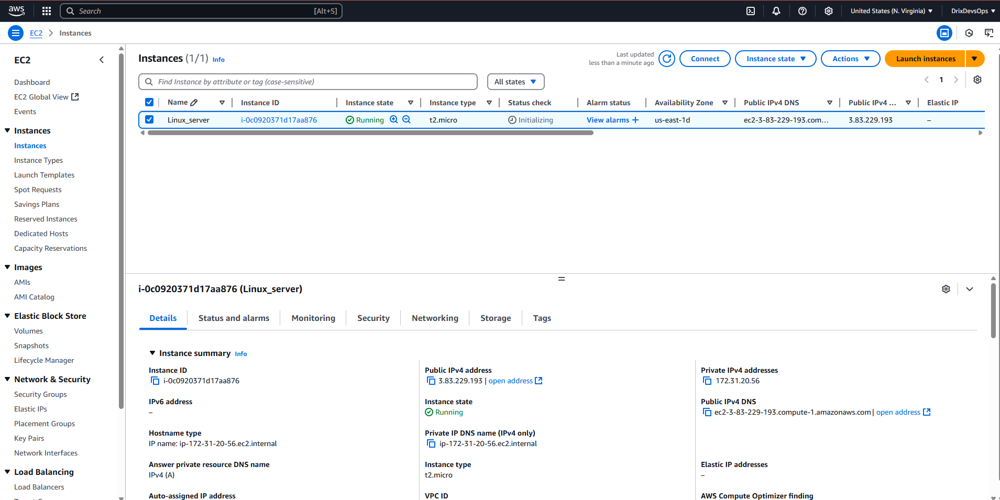
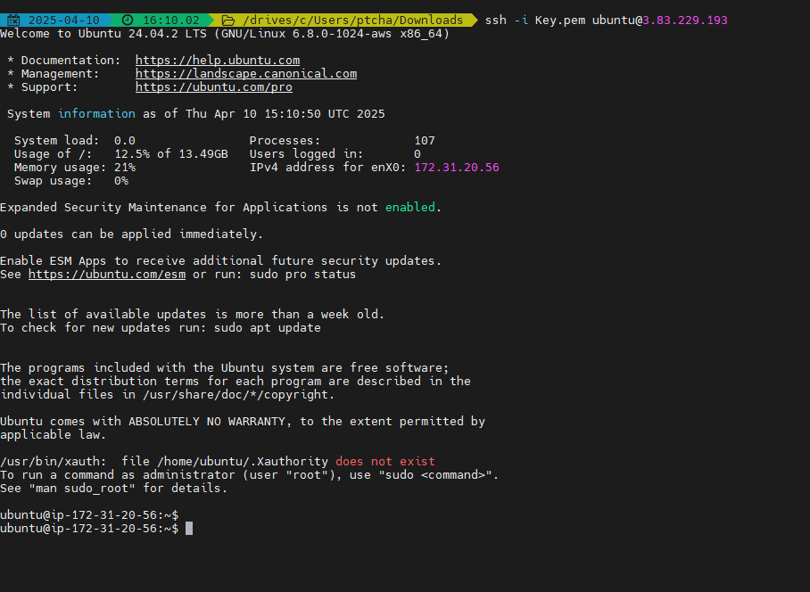
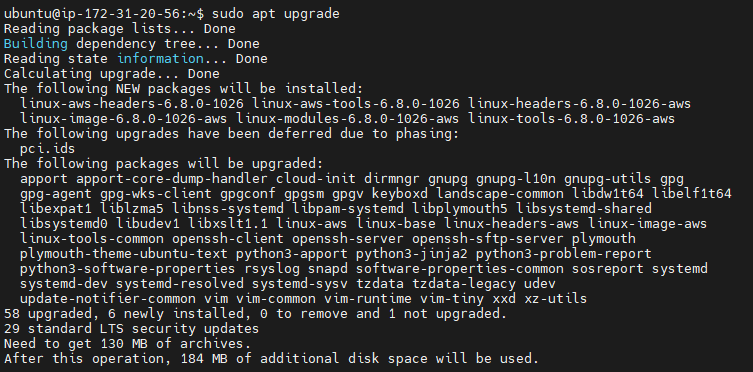
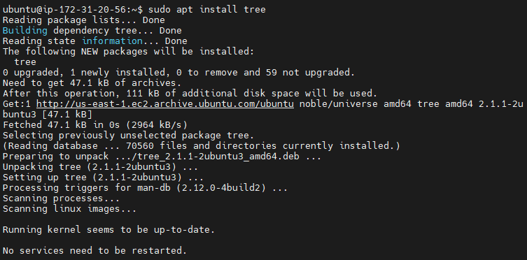
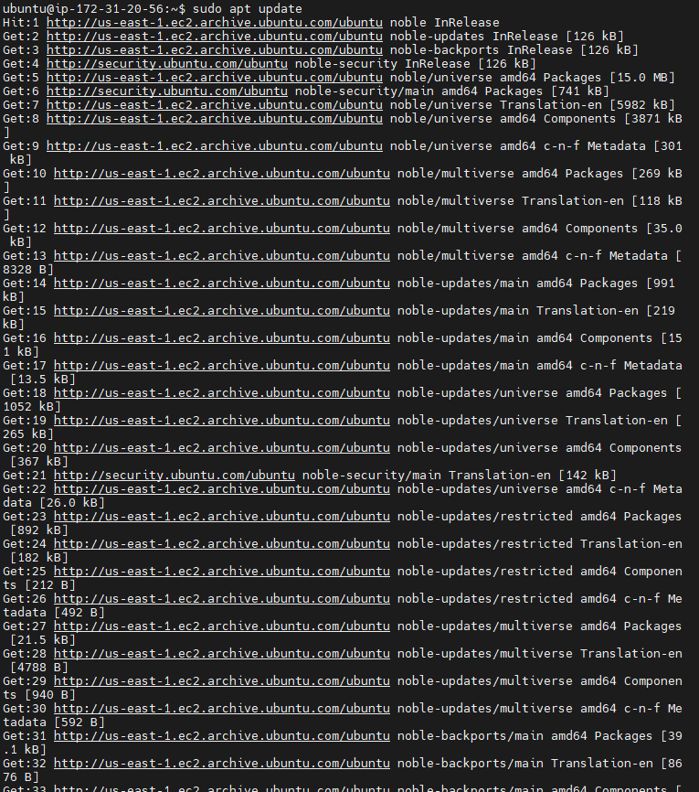
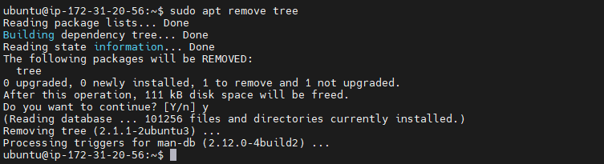

# Linux Fundamentals: My Learning Journey

This repository documents my hands-on exploration of Linux fundamentals following a structured project-based learning approach. I've captured key steps and screenshots to demonstrate my understanding of core Linux concepts.

## Introduction to Linux

I began by learning that Linux is a free, open-source operating system known for its stability, security, and flexibility. It powers a wide range of devices from servers to smartphones and forms the backbone of much of the internet's infrastructure.

## Linux Distributions Explored

I gained an understanding of different Linux distributions (distros):
- **Ubuntu**: User-friendly, great for beginners and widely used
- **CentOS**: Popular for enterprise environments due to its stability
- **Debian**: Known for its commitment to free and open-source principles
- **Fedora**: Cutting-edge distro that incorporates the latest technologies

## Setting Up My Linux Server

### Creating an AWS EC2 Instance

I followed the instructions to provision an Ubuntu server on AWS:

1. Signed into my AWS account
2. Navigated to EC2 services
3. Selected "Launch Instance"
4. Configured an Ubuntu server

Here's my EC2 instance running in the AWS console:



### Connecting to My EC2 Instance

I used MobaXterm as my client tool on Windows to connect to my EC2 instance via SSH:

1. Located my downloaded `.pem` key file
2. Connected using the SSH command:

 ```bash 
ssh -i "key.pem" ubuntu@3.83.229.193
```

Successfully connected to my remote server:




## Package Management

I learned about package managers and practiced using `apt` for my Ubuntu server:

### Updating Package Lists

First, I updated my package lists to ensure I had access to the latest software:

```bash
sudo apt update
```


### Installing Softwares
I installed the `tree` utility to visualize file system structures using the command line: 
```bash
sudo apt install tree
```


### Using installed packages
I learned to keep the system up-date with:
```bash
sudo apt upgrade
```


### Removing Softwares
Finally, I uninstalled the `tree` package to clean up my system:

```bash
sudo apt remove tree
```


### Conclusion
Through this project, I've gained hands-on experience with Linux fundamentals, including setting up a server, connecting via SSH, and managing packages. This foundational knowledge will serve as a stepping stone for more advanced topics in Linux and system administration and my journey in the world of Devops.